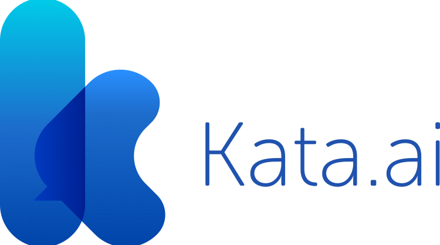

# Welcome to KataDocs

## Introduction

Kata Command Line Interface (Kata CLI) is a tool for creating bots with
Kata Machine Learning (Kata ML) which suited with Natural Language Processing (NLP) technology.
Kata CLI also helps managing the bots with command line / shell of various operating systems.

For more information, check [our website](http://kata.ai/en).

<a href="http://kata.ai/en"></a>

## Installation

### Try Kata Platform

Install Kata-CLI at your device, using this command:

```
$ npm install -g kata-cli
```

now you can use command 'kata' globally

## Commands

Use `kata --help` to see commands list available

*   `kata bot-init|init [options] <bot> <name> [version]` - Init the bot
*   `kata bot-versions|versions` - List versions of the bot
*   `kata bot-list|list-bots` - List the bots
*   `kata bot-push|push [options]` - Push the bot
*   `kata bot-delete|remove-bot` - Delete selected bot
*   `kata bot-test|test [file]`
*   `kata bot-console|console [options] <diaenneUrl>`
*   `kata deployment-deploy|deploy <name> [version]` - Deploy the bot
*   `kata deployment-addChannel|add-channel [options] <name> <channelName>` - Add bot channel
*   `kata deployment-removeChannel|remove-channel <name> <channelName>` - Remove bot channel
*   `kata deployment-drop|drop <name>`
*   `kata session-get <id> [deploymentId]`
*   `kata session-create [options] [id] [deploymentId]`
*   `kata session-update [options] <id> [deploymentId]`
*   `kata session-delete <id> [deploymentId]`
*   `kata set <prop> <value>`
*   `kata login [options] <type> [name]`

### Login

To start developing your bot,
you need to login using your account as user

```
$ kata login user -u <username>
password: <password>
```

Login  using your account as team

```
$ kata login team <teamName> -u <username>
password: <password>
```

Login using token

```
$ kata login user -t <token>
```

<!-- 
## Commands

* `mkdocs new [dir-name]` - Create a new project.
* `mkdocs serve` - Start the live-reloading docs server.
* `mkdocs build` - Build the documentation site.
* `mkdocs help` - Print this help message.

## Project layout

    mkdocs.yml    # The configuration file.
    docs/
        index.md  # The documentation homepage.
        ...       # Other markdown pages, images and other files.
 -->